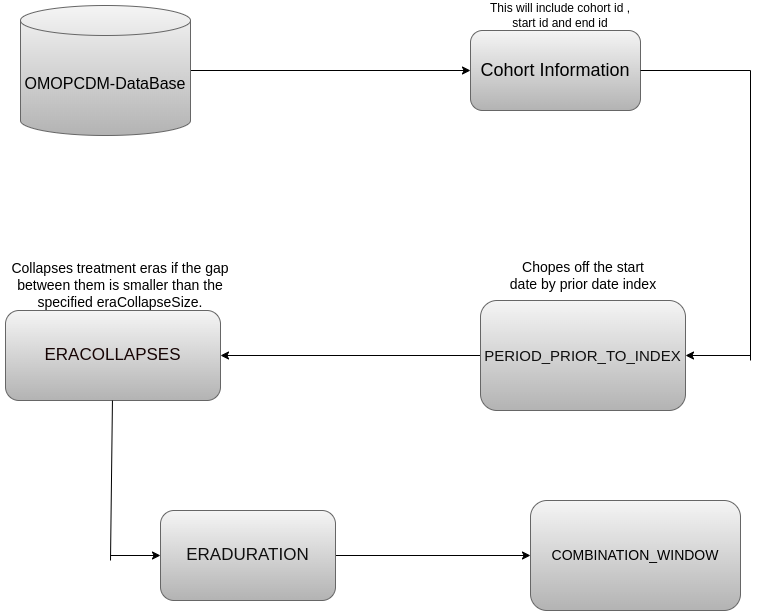

## Running a full pathway synthesis with `execute_treatments`

`execute_treatments` is a *sewing* function: it runs every pre-processing step in
order and returns one tidy `DataFrame` of treatment eras per person. It mirrors
the `constructPathways` pipeline of the R package
[`TreatmentPatterns`](https://github.com/mi-erasmusmc/TreatmentPatterns):

```
query cohorts ─▶ create_treatment_history (periodPriorToIndex, include_treatments)
              ─▶ calculate_era_duration   (minEraDuration)
              ─▶ EraCollapse              (eraCollapseSize, per person & treatment)
              ─▶ combination_Window       (combinationWindow — Switch / FRFS / LRFS)
              ─▶ minPostCombinationDuration_filter (minPostCombinationDuration)
```

### Setup

The connection only needs a `cohort` table holding your target and event cohorts
(`cohort_definition_id`, `subject_id`, `cohort_start_date`, `cohort_end_date`).
`MakeTables` wires up the internal `cohort` / `dialect` bindings the function
queries against:

```julia
using OMOPCDMPathways
using SQLite, DataFrames, Dates
import DBInterface

conn = SQLite.DB("eunomia.sqlite")
MakeTables(conn, :sqlite, "main")
```

### Call

```julia
pathways = execute_treatments(
    conn,
    1,               # target cohort_definition_id
    [2, 3];          # event (treatment) cohort_definition_ids
    min_era_duration = 5,
    era_collapse_size = 30,
    period_prior = Day(365),
    combination_window = Day(30),
    min_post_combination_duration = 30,
    include_treatments = "startDate",
)
```

### Result

One row per treatment era, sorted by `person_id`, `event_start_date`:

```
 Row │ person_id  event_start_date  event_end_date  event_cohort_id  GAP_PREVIOUS  SELECTED_ROWS
     │ Int64      Date              Date            Int64            Int64?        Int64
─────┼───────────────────────────────────────────────────────────────────────────────────────────
   1 │         1  2015-02-01        2015-05-01                   2       missing              0
   2 │         1  2015-08-01        2015-12-01                   3            92              0
   3 │         2  2016-01-01        2016-03-20                   2       missing              0
   4 │         2  2016-03-20        2016-07-01                   3             0              0
```

- `event_cohort_id` is the treatment's `cohort_definition_id`.
- `event_start_date` / `event_end_date` are the era bounds *after* switch and
  combination adjustments.
- `GAP_PREVIOUS` is the day gap to the previous era for the same person
  (`missing` for their first era); `SELECTED_ROWS` is `1` while an era still
  overlaps the previous one.

### Notes

- `era_collapse_size` is applied per `(person, treatment)`: two eras of the *same*
  treatment separated by a gap larger than `era_collapse_size` days are collapsed
  to the first; eras of *different* treatments are never dropped against each
  other.
- If every era is filtered out, an empty `DataFrame` with the same columns is
  returned.
- The building blocks remain available individually
  ([`create_treatment_history`](@ref), [`calculate_era_duration`](@ref),
  [`EraCollapse`](@ref), [`combination_Window`](@ref),
  [`minPostCombinationDuration_filter`](@ref)) if you need a custom pipeline.
